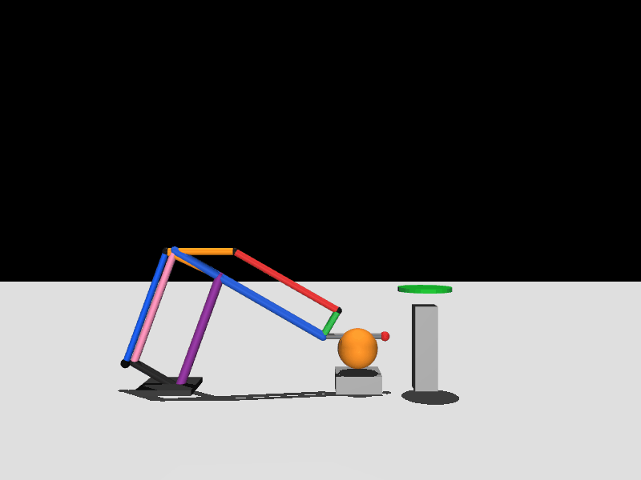
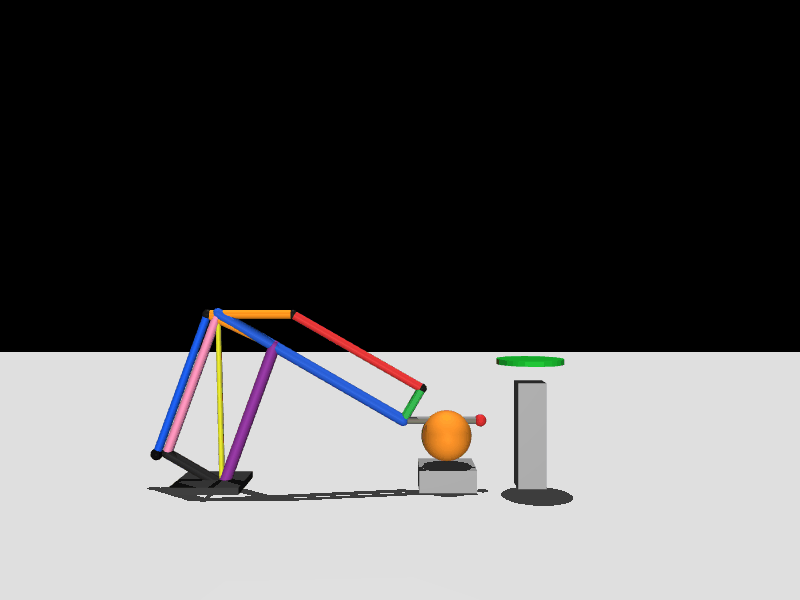

# Dinamica

Repositorio del trabajo de Dinamica con notebooks, scripts de MuJoCo y entregables del Taller 2.

## Resumen

El entregable principal es el Taller 2 del mecanismo planar, resuelto sobre la base del Taller 1 sin borrar el contenido original del notebook. La solucion final incluye:

- cinematica del mecanismo
- cinematica inversa para recogida y liberacion
- trayectoria con splines quínticos por tramos
- dinamica inversa con carga util
- seleccion de resorte lineal
- visualizacion en MuJoCo

## Resultados principales

- tiempo total de trayectoria: `6.90 s`
- llegada al aro: `6.50 s`
- error final en `release`: practicamente `0 mm`
- configuracion final del resorte: union en `C`, anclaje `[0, -30] mm`, `k = 4.0 N/m`
- reduccion de pico en fase cargada: `53.59 %` y `68.95 %`
- reduccion RMS en fase cargada: `45.02 %` y `85.61 %`

## Vista previa

MuJoCo sin resorte:



MuJoCo con resorte:



## Contenido principal

- `code/Taller 2.ipynb`
  Notebook principal del Taller 2. Conserva la base original y agrega la solucion completa de cinematica, trayectoria por splines por tramos, dinamica inversa, seleccion de resorte y visualizacion en MuJoCo.
- `code/taller2_mujoco_common.py`
  Modulo comun para reconstruir la geometria, la trayectoria y la escena en MuJoCo.
- `code/taller2_mujoco_con_resorte.py`
  Viewer y exportacion de la escena final con resorte.
- `code/taller2_mujoco_sin_resorte.py`
  Viewer y exportacion de la escena final sin resorte.
- `datasets/Taller2_reporte_final.md`
  Informe editable del Taller 2.
- `datasets/Taller2_reporte_final.pdf`
  Informe final exportado en PDF.

## Estructura

```text
Dinamica/
├── archive/
├── code/
└── datasets/
```

## Requisitos

Python 3.9 o superior con estas librerias:

- `numpy`
- `scipy`
- `sympy`
- `mujoco`
- `ipykernel`
- `nbclient`
- `Pillow`

En macOS, el viewer interactivo de MuJoCo necesita `mjpython`. Los scripts ya intentan relanzarse automaticamente con ese launcher cuando hace falta.

## Ejecutar MuJoCo

Con resorte:

```bash
python3 'code/taller2_mujoco_con_resorte.py'
```

Sin resorte:

```bash
python3 'code/taller2_mujoco_sin_resorte.py'
```

Resumen sin abrir el viewer:

```bash
python3 'code/taller2_mujoco_con_resorte.py' --summary
```

Exportar GIF:

```bash
python3 'code/taller2_mujoco_con_resorte.py' --gif 'datasets/taller2_mujoco_with_spring.gif'
python3 'code/taller2_mujoco_sin_resorte.py' --gif 'datasets/taller2_mujoco_without_spring.gif'
```

## Archivos relevantes del Taller 2

- `code/Taller 2.ipynb`
- `code/taller2_mujoco_common.py`
- `code/taller2_mujoco_con_resorte.py`
- `code/taller2_mujoco_sin_resorte.py`
- `datasets/Taller2_reporte_final.md`
- `datasets/Taller2_reporte_final.pdf`
- `datasets/taller2_mujoco_with_spring.gif`
- `datasets/taller2_mujoco_without_spring.gif`
- `datasets/taller2_mujoco_with_spring_frame0.png`
- `datasets/taller2_mujoco_without_spring_frame0.png`

## Notas

- El modelo final deja el deflector paralelo al piso en la configuracion corregida del Taller 2.
- La escena de MuJoCo fue refinada visualmente para que la base no tape el movimiento del mecanismo.
- Algunos GIF y frames intermedios no se versionan porque son artefactos regenerables.
