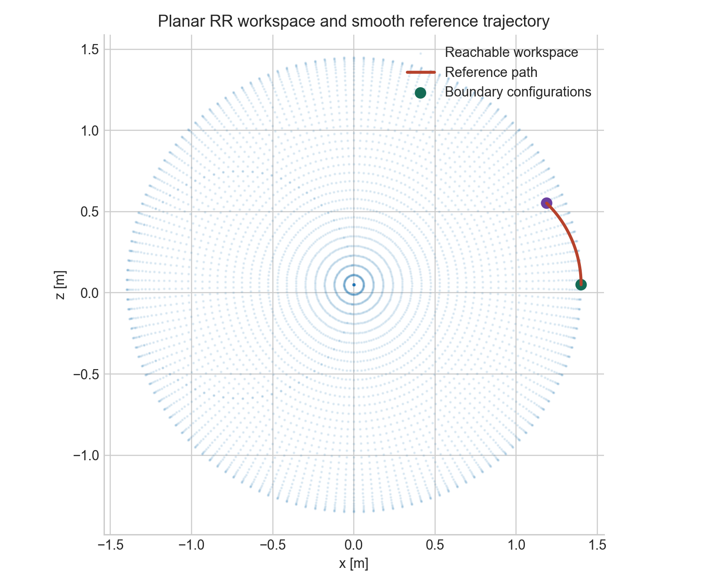
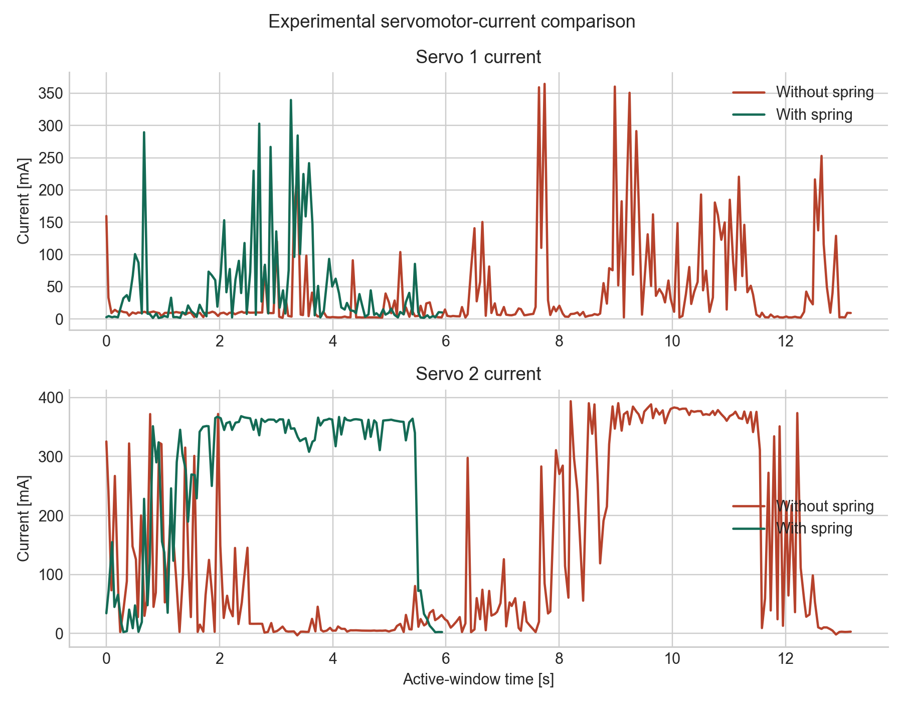

# Spring-Assisted Robotic Mechanism: Dynamics, Trajectory Planning, and Validation

Mechanical dynamics and robotics portfolio from the Dynamics CPO
(Professional Cycle Elective) at Universidad de los Andes. Dynamics is one of
my strongest areas of engineering interest.

The featured project combines mechanism kinematics, workspace analysis,
piecewise quintic trajectories, inverse dynamics, spring-assistance design,
MuJoCo visualization, and experimental servomotor-current comparison.



## Project Abstract

The main project studies a planar robotic mechanism that transports an `80 g`
payload between prescribed points in less than `10 s`. The workflow reconstructs
mechanism geometry, solves inverse kinematics, generates rest-to-rest spline
trajectories, evaluates inverse-dynamics torque, selects a linear spring to
reduce actuator demand, visualizes motion in MuJoCo, and compares measured
servomotor current with and without spring assistance.

The repository also contains mechanism-synthesis work, including biologically
inspired trajectory extraction, four-bar and six-bar analysis, collision
metrics, and MuJoCo rendering.

## Engineering Objectives

- Model planar robotic mechanisms using reference frames and loop closure.
- Evaluate forward and inverse kinematics, Jacobians, and workspace limits.
- Generate smooth piecewise quintic trajectories with rest-to-rest constraints.
- Estimate torque demand through inverse dynamics.
- Reduce actuator demand through spring placement and stiffness selection.
- Validate design decisions using experimental servomotor-current traces.
- Preserve advanced MuJoCo and mechanism-synthesis coursework as supporting
  evidence.

## Mathematical Formulation

For the portable RR reference model,

```math
\mathbf{p}(q)=
\begin{bmatrix}
L_1\cos q_1 + L_2\cos(q_1+q_2)\\
z_0 - L_1\sin q_1 - L_2\sin(q_1+q_2)
\end{bmatrix}
```

```math
\dot{\mathbf{p}} = J(q)\dot q
```

and the inverse-dynamics structure is

```math
\tau=M(q)\ddot q+C(q,\dot q)\dot q+g(q)+\tau_f-\tau_s.
```

See [Mathematical Formulation](docs/mathematical-formulation.md) for the
Jacobian, spline interpolation, and spring-design objective.

## Assumptions

- The portable RR model is a reviewable reference layer for workspace and
  Jacobian analysis.
- The complete workshop mechanism remains available in the preserved notebooks
  and MuJoCo scripts.
- Experimental current is treated as a practical proxy for actuator demand.
- Course submissions retain their historical language and filenames when
  necessary for traceability.

## Methodology

1. Reconstruct mechanism geometry and relevant reference frames.
2. Evaluate workspace reachability and solve inverse kinematics.
3. Generate quintic rest-to-rest trajectories across task waypoints.
4. Calculate torque demand and search spring configurations.
5. Visualize the mechanism and spring in MuJoCo.
6. Compare measured current traces with and without the spring.
7. Export portable figures and machine-readable summaries.

## Results

The workshop analysis selected a spring attached to point `C` with:

- stiffness: `4.0 N/m`;
- free length: `53.72 mm`;
- maximum spring force: `0.309 N`;
- peak torque reduction: `53.59%` for motor 1 and `68.95%` for motor 2;
- RMS torque reduction: `45.02%` for motor 1 and `85.61%` for motor 2.

The portable workflow regenerates workspace, Jacobian-conditioning, and
experimental-current figures:



The measured current traces do not show a uniform improvement across every
metric. They are preserved as an honest experimental comparison and motivate
the instrumentation improvements listed under future work.

## Discussion

This repository provides evidence across mechanical dynamics, robotics,
simulation, design tradeoffs, optimization, and experimental validation. Its
strongest feature is the link between analytical modeling and a measurable
actuator-demand reduction strategy rather than visualization alone.

## Repository Structure

```text
data/        Raw experimental current measurements
docs/        GitHub Pages-ready technical documentation
figures/     Generated publication-quality plots
notebooks/   Preserved coursework notebooks
reports/     Reports and archived submissions
results/     Generated numerical summaries
src/         Portable analysis, MuJoCo workflows, and embedded code
tests/       Lightweight regression tests
```

## Installation

```bash
python3 -m venv .venv
source .venv/bin/activate
python -m pip install -r requirements.txt
```

MuJoCo workflows require the optional packages listed in
[`requirements-mujoco.txt`](requirements-mujoco.txt).

## Reproducibility

```bash
python src/dynamics/spring_assisted_robot.py
python -m unittest discover -s tests -v
```

See the [Reproducibility Guide](docs/reproducibility.md) for advanced MuJoCo
workflows.

## Future Work

- Instrument joint angles and synchronize current, position, and torque data.
- Use constrained optimization for spring anchor placement and stiffness.
- Integrate CAD-derived link inertias and tolerance analysis.
- Validate the mechanism using motion capture and hardware-in-the-loop control.
- Add fatigue and manufacturability analysis for spring mounts and links.

## References

- J. J. Craig, *Introduction to Robotics: Mechanics and Control*, Pearson.
- R. M. Murray, Z. Li, and S. S. Sastry, *A Mathematical Introduction to
  Robotic Manipulation*, CRC Press.
- [MuJoCo documentation](https://mujoco.readthedocs.io/)

## Documentation

Start with the [GitHub Pages-ready documentation](docs/index.md) and the
[portfolio evaluation](docs/portfolio-evaluation.md).
